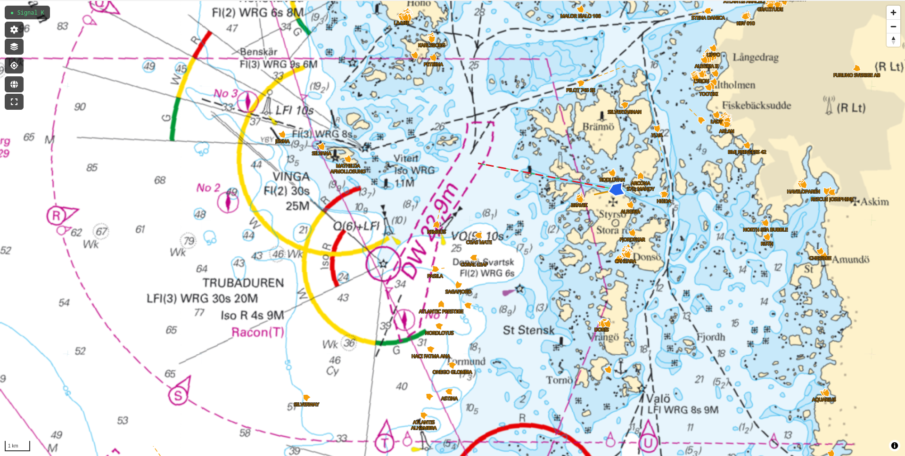

# Portolan

A fast and reliable sea chart plotting application for [Signal K](https://signalk.org/).



## Why another chart plotter for SignalK
Portolan is an experiment to overcome some of [Freeboard-sk](https://github.com/SignalK/freeboard-sk)'s limitations.

My sailing tablet gets laggy as soon as Freeboard has many AIS target, chart layers, waypoints or routes to show. Portolan is written with speed in mind, uses WASM for heavy computation and WebGL for rendering.

Portolan tries to be projection-agnostic. Currently, there are two projection modes: mercator and globe.  Routes are great-circle by default.

Being a system for marine navigation, Portolan takes great effort in correctness and avoiding bugs.

## Getting started

### Prerequisites
- [Rust](https://rustup.rs/) + `wasm32-unknown-unknown` target
- [wasm-pack](https://rustwasm.github.io/wasm-pack/)
- Node.js 18+
- A running [Signal K server](https://signalk.org/)

```sh
rustup target add wasm32-unknown-unknown
cargo install wasm-pack
```

### Run

```sh
# 1. Build the Rust/WASM core
cd app && npm run build:wasm

# 2. Install frontend dependencies (first time only)
npm install

# 3. Start the dev server
npm run dev
```

Open `http://localhost:5173`. Edit `src/App.svelte` to point `SIGNALK_WS` at your Signal K server.

### Deploy

Build a production-optimised bundle into `app/dist/`:

```sh
make build
# or manually:
cd app && npm run build:wasm && npm run build
```

`app/dist/` is a self-contained static site — serve it with any HTTP server.

**Option A — on the boat (recommended): serve from the Signal K server**

Signal K's built-in HTTP server can host static webapps under `@signalk/server-admin-ui` plugin directory. Copy `app/dist/` to:
```
~/.signalk/plugin-config-data/<your-subfolder>/
```
and expose it via a Signal K webapp plugin, or simply drop the `dist/` contents into Signal K's `public/` directory and reach it at `http://<server>:3000/`.

**Option B — standalone static server**

Any `serve`-compatible tool works:
```sh
npx serve app/dist
# or nginx, caddy, etc.
```

**Option C — install as PWA**

With the dev server or any of the above servers running, open the app in Chrome/Edge/Firefox and use "Add to Home Screen" / "Install app". The PWA manifest (`display: standalone`) gives a full-screen, no-chrome experience — no browser address bar at the helm.

### Run Rust tests

```sh
cargo test
```

## Design
Do one task, do it good. This means that some features might be left to other layers. E.g. notification and alarm management as well as instrument might be left to KIP. Stable, Fast, Correct

See [`KNOWLEDGE_BASE.md`](./KNOWLEDGE_BASE.md) for full architecture decisions, user stories, and open questions.

## Additional features compared to Freeboard
- Globe projection
- WebGL rendering
- WMTS layer discovery
- AIS target to scale
- Great-circle
- Highly customizable appearance
- 3D mode

## Missing features compared to Freeboard
- S57 support (planned)
- Alarm management
- Anchor (planned)

## Roadmap

- [ ] Tracks
- [ ] Wind particle overlay
- [ ] Tauri packaging (Android + Windows)
- [ ] S-57 vector chart support
